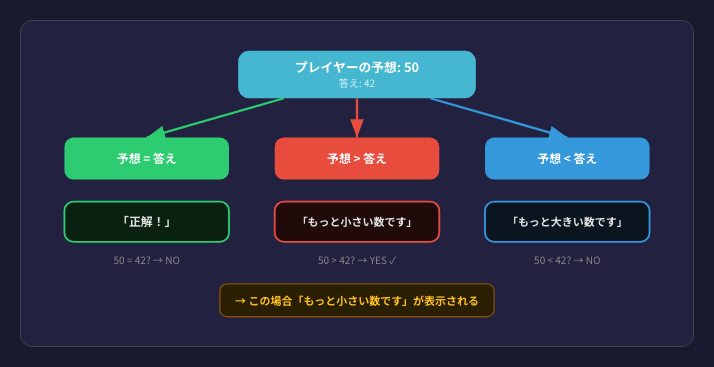
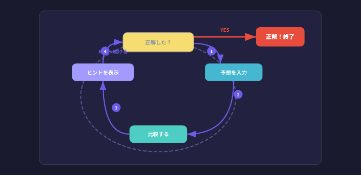
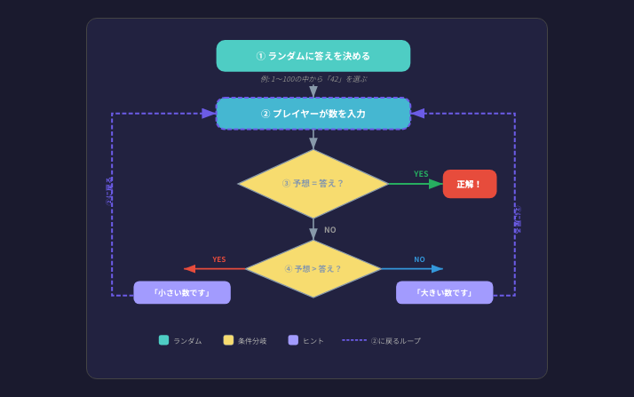

# 第1回: ガイダンス + 数当てゲーム

---

> **Notionノート提出について**
> この回では、以下の **計7つの項目** をNotionの授業ノートに記述して提出してください。
>
> - ✏️ トレース演習 × 2つ（表を埋めて記述）
> - 🟪 コード体験の観察記録 × 2つ（結果と考察を記述）
> - 🟩 標準課題 × 2つ（解答を記述）
> - 🟧 発展課題 × 1つ（考察 + 音声を添付）

---

## 1. 説明

### この回で理解すること

数当てゲームを題材に、プログラムの3つの基本的な仕組みを理解します。
コードを書くことが目的ではなく、**仕組みを言葉と図で説明できるようになること**がゴールです。

---

### 1.1 ランダム — サイコロを振るイメージ

> サイコロを振ると、1〜6のどれかが**ランダム**に出ます。
> どの目が出るかは、振る前には分かりません。

プログラムでも同じことができます。「1〜100の中からランダムに1つ選ぶ」と指示すると、毎回違う数が返ってきます。

**数当てゲームでの役割:** コンピュータが「答え」をランダムに決める部分に使います。

---

### 1.2 条件分岐 — 信号機のイメージ

「条件によって、やることが変わる」のが条件分岐です。
数当てゲームでは、プレイヤーの予想と答えを比較して3つのパターンに分岐します。



---

### 1.3 繰り返し — 自動販売機のイメージ

> 自動販売機にお金を入れる。足りない → もう一度入れる。
> **足りたら** → 商品が出てくる。

「ある条件が満たされるまで、同じことを繰り返す」のがループです。
数当てゲームでは、**正解するまで**何度でも予想を繰り返します。



---

### 1.4 数当てゲームの全体像

3つの仕組みを組み合わせると、ゲームの全体像がこうなります。



---

## 2. 例題とトレース演習

### 🔷 例題1: ゲームの流れを追う

コンピュータの答えが **7** のとき、プレイヤーが 5 → 9 → 7 と予想した場合を追ってみましょう。

| 回数 | プレイヤーの予想 | 答え(7)との比較 | 表示されるヒント | ゲーム継続？ |
|------|----------------|----------------|----------------|-------------|
| 1    | 5              | 5 < 7          | もっと大きい数です | はい       |
| 2    | 9              | 9 > 7          | もっと小さい数です | はい       |
| 3    | 7              | 7 = 7          | 正解！           | いいえ（終了）|

**読み方のポイント:**
- 毎回「予想と答えの大小関係」を確認する
- ヒントを手がかりに次の予想を決める
- 「=」になった瞬間にゲームが終わる

---

### ✏️ トレース演習1 【Notionに記述して提出】

**問題:** コンピュータの答えが **23** のとき、以下の予想をした場合の表を完成させなさい。

予想の順番: 30 → 15 → 25 → 20 → 23

| 回数 | 予想 | 答え(23)との比較 | ヒント | ゲーム継続？ |
|------|------|-----------------|--------|-------------|
| 1    | 30   |                 |        |             |
| 2    | 15   |                 |        |             |
| 3    | 25   |                 |        |             |
| 4    | 20   |                 |        |             |
| 5    | 23   |                 |        |             |

> **Notionへの記述:** 上の表を自分のNotionノートにコピーし、空欄を埋めて提出してください。

---

### 🔷 例題2: コードの出力を予測する

以下のコードは「答え=10、予想=15」のときに何が起こるかを示しています。

```python
answer = 10
guess = 15

if guess == answer:
    print("正解！")
elif guess > answer:
    print("もっと小さい数です")
else:
    print("もっと大きい数です")
```

**読み方:**
1. `guess == answer` → 15 == 10 → **NO**（この行はスキップ）
2. `guess > answer` → 15 > 10 → **YES**（この行が実行される）
3. 結果: **「もっと小さい数です」** が表示される

---

### ✏️ トレース演習2 【Notionに記述して提出】

**問題:** 以下の3つのケースで、それぞれ何が表示されるか予測しなさい。

```python
answer = 20
```

| ケース | guess の値 | 表示される文字列（あなたの予測） |
|--------|-----------|-------------------------------|
| A      | 25        |                               |
| B      | 20        |                               |
| C      | 12        |                               |

> **Notionへの記述:** 上の表をNotionノートにコピーし、予測を記入してください。
> 予測を書いた**後に**、実際にコードを実行して確かめ、合っていたかどうかも記録してください。

---

## 3. コード体験

**自分でコードを書く必要はありません。**用意されたコードをコピーして実行し、結果を**観察**してください。
コピーして実行し、結果を**観察**してください。

---

### 🟪 コード体験1: 数当てゲームを遊ぶ 【Notionに観察記録を提出】

以下のコードをコピーして実行し、実際にゲームを遊んでください。

```python
import random

# コンピュータが1〜50の中からランダムに答えを決める
answer = random.randint(1, 50)

# 試行回数を記録する変数
count = 0

# 正解するまで繰り返す
while True:
    # プレイヤーに予想を入力してもらう
    guess = int(input("1〜50の数を予想してください: "))
    
    # 試行回数を1増やす
    count = count + 1
    
    # 予想と答えを比較する（条件分岐）
    if guess == answer:
        print(f"正解！ 答えは {answer} でした！")
        print(f"{count}回で当たりました")
        break
    elif guess > answer:
        print("もっと小さい数です")
    else:
        print("もっと大きい数です")
```

**観察課題:**

> **Notionへの記述:** 以下の3項目をNotionノートに記録してください。
>
> 1. 何回で正解できましたか？ → ＿＿回
> 2. どんな戦略で予想しましたか？（例: 適当に / 真ん中から攻めた / 等）
> 3. もう一度遊んで、1回目より早く当てられましたか？ その理由は？

---

### 🟪 コード体験2: 回数制限を観察する 【Notionに観察記録を提出】

以下は**5回まで**しか予想できないバージョンです。

```python
import random

answer = random.randint(1, 30)
max_tries = 5

print(f"1〜30の数を当ててください（{max_tries}回以内）")

for i in range(max_tries):
    remaining = max_tries - i
    print(f"（残り{remaining}回）")
    
    guess = int(input("予想: "))
    
    if guess == answer:
        print(f"正解！ {i+1}回目で当たりました！")
        break
    elif guess > answer:
        print("もっと小さい数です")
    else:
        print("もっと大きい数です")
else:
    print(f"残念！ 答えは {answer} でした")
```

**観察課題:**

> **Notionへの記述:** 以下の3項目をNotionノートに記録してください。
>
> 1. 5回以内に当てられましたか？ → はい / いいえ
> 2. `max_tries = 3` に変えて実行してください。難しくなりましたか？
> 3. 回数制限があるとき、どんな戦略で予想すると効率がいいですか？ 自分の考えを書いてください。

---

## 4. 標準課題

### 🟩 標準課題1: ゲームの流れを言葉で説明する 【Notionに記述して提出】

**課題:** 上のコード体験1の数当てゲームが「何をしているか」を、以下の空欄を埋めて説明しなさい。

```
① コンピュータが＿＿から＿＿の範囲でランダムに答えを決める
② プレイヤーが＿＿＿＿を入力する
③ 入力した数と答えを＿＿＿＿する
④ 同じなら＿＿＿＿と表示してゲーム終了
⑤ 入力が大きければ＿＿＿＿と表示
⑥ 入力が小さければ＿＿＿＿と表示
⑦ ②に戻って＿＿＿＿する
```

> **Notionへの記述:** 空欄を埋めた文章をNotionノートに記述してください。

---

### 🟩 標準課題2: コードの動きを予測する 【Notionに記述して提出】

**課題:** 以下のコードを**実行せずに**出力を予測しなさい。予測を書いた後に実行して確かめなさい。

```python
answer = 10
guess = 15

if guess == answer:
    print("正解！")
elif guess > answer:
    print("もっと小さい数です")
else:
    print("もっと大きい数です")

print("判定終了")
```

> **Notionへの記述:** 以下の形式でNotionノートに記録してください。
>
> - あなたの予測: ＿＿＿＿＿
> - 実行結果: ＿＿＿＿＿
> - 予測は合っていましたか？: はい / いいえ
> - （合っていなかった場合）なぜ間違えたか: ＿＿＿＿＿

---

## 5. 発展課題

### 🟧 発展課題: 「効率のいい当て方」を考える 【Notionに考察 + 音声を提出】

**課題:**

コンピュータの答えが 1〜100 のどれかです。
あなたは最大何回予想すれば**必ず**正解にたどり着けますか？

> **Notionへの記述:** 以下をNotionノートに記述し、**音声（1〜2分）** を録音して添付してください。
>
> 1. 自分の戦略を**言葉と図**で説明する（コードは不要）
> 2. その戦略で最大何回かかるか、理由とともに答える
> 3. 音声で「どんな戦略を考えたか」「なぜその回数で当たるのか」を説明する

**ヒント:** まず真ん中の50を予想すると、「大きい」か「小さい」で半分に絞れます。これを繰り返すと…？
（この考え方は第4回の「二分探索」で詳しく学びます）

**※ 解答例はありません。自分の言葉で考えてください。**

---

## 6. グループ質問カード

3人グループで以下の質問を出し合い、記録シートに結果を記入してください。
役割は毎ラウンド交代します（出題者→回答者→記録者）。

---

**【出力予測①】**

```python
x = 10
if x > 5:
    print("A")
else:
    print("B")
```

→ 何が表示されますか？

---

**【出力予測②】**

```python
x = 10
if x > 5:
    print("A")
if x > 8:
    print("B")
```

→ 何が表示されますか？ ①との**違い**は何ですか？

---

**【理由説明①】**

→ 数当てゲームで `while True:` と書いて無限ループにしていますが、なぜゲームは永遠に続かないのですか？

---

**【理由説明②】**

→ 「1〜100」と「1〜10」では、どちらが早く当たりますか？ 理由も説明してください。

---

**【改造】**

→ 回数制限（5回まで）を加えるとしたら、プログラムのどの部分をどう変えますか？
コードを書かなくていいので、考え方を口頭で説明してください。

---

## 7. 解答例

### 🟩 標準課題1 解答

```
① コンピュータが 1 から 50 の範囲でランダムに答えを決める
② プレイヤーが 予想の数 を入力する
③ 入力した数と答えを 比較 する
④ 同じなら 「正解！」 と表示してゲーム終了
⑤ 入力が大きければ 「もっと小さい数です」 と表示
⑥ 入力が小さければ 「もっと大きい数です」 と表示
⑦ ②に戻って 繰り返し する
```

---

### 🟩 標準課題2 解答

- 予測: 「もっと小さい数です」と「判定終了」の2行が表示される
- 理由:
  - `guess(15)` は `answer(10)` と等しくないので `if` は通らない
  - `guess(15) > answer(10)` なので `elif` の条件が成立
  - 「もっと小さい数です」が表示される
  - `print("判定終了")` は if文の外にあるので必ず実行される

---

### ✏️ トレース演習1 解答

| 回数 | 予想 | 答え(23)との比較 | ヒント | ゲーム継続？ |
|------|------|-----------------|--------|-------------|
| 1    | 30   | 30 > 23         | もっと小さい数です | はい |
| 2    | 15   | 15 < 23         | もっと大きい数です | はい |
| 3    | 25   | 25 > 23         | もっと小さい数です | はい |
| 4    | 20   | 20 < 23         | もっと大きい数です | はい |
| 5    | 23   | 23 = 23         | 正解！ | いいえ（終了） |

---

### ✏️ トレース演習2 解答

| ケース | guess の値 | 表示される文字列 |
|--------|-----------|----------------|
| A      | 25        | もっと小さい数です |
| B      | 20        | 正解！ |
| C      | 12        | もっと大きい数です |
